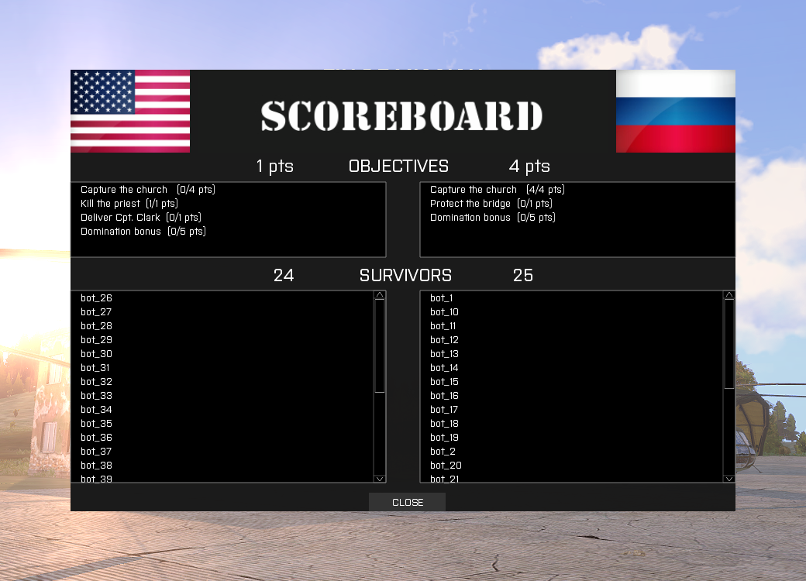

# SCORE_BOARD MODULE

## Data card

| FIELD                   | VALUE
|-------------------------|-------------
| folder name             | score_board
| last modification date  | 2015-01-10
| Ojective                | compute scores & display scoreboard at the end of the time-boxed game
| Default                 | enabled
| Extra Parameters        | yes

## Description

This module is complex and provides a lot of functionalities:

* define missions objectives for each side
* provides custom scripts code execution
* define the duration of the mission
* display the end time
* compute scores on the server, dispatch them and display them on a scoreboard at the end of the mission

How it works:

At the start of the mission, a message provide the local time (in-game clock) when the scores will be computed by the server (and clients will display another message ""):

    End of Mission: HH:MM

#### Mission Objectives

First, you need to describe the objectives for both sides. This is done inside file *init.sqf* inside the OMTK_SB_LIST_OBJECTIFS array. 

    OMTK_SB_LIST_OBJECTIFS = [  
	    objective1,  
	    objective2,  
	    ...,  
	    last_objective
    ];  

Each single objective is an array itself:

    [points, side, objective_type, objective_label, specific_parameters]  

With:

* points: number of points (natural number, can be negative to behave like a penalty)
* side: the side to which the objective is assigned, value among {"BLUEFOR"|"REDFOR"|"BLUEFOR+REDFOR"}
* objective_type: value among {"SURVIVAL"|"DESTRUCTION"|"IN"|"OUT"|"ACTION"|"FLAG"}
* objective_label: the text displayed into the scoreboard
* specific_parameters: additional parameter(s) related to the chosen objective type

##### SURVIVAL/DESTRUCTION

SURVIVAL objective means "the subject" has to be alive/not destroyed at the end of the game. On the opposite, DESTRUCTION means that the subject has to be killed/destroyed at the end.  
One specific parameter define the subject. It is an array again:  

      [MODE, VALUES]

MODE can be one of {"BLUEFOR"|"REDFOR"|"DIFF"|"LIST"|"OMTK_ID"} :

* BLUEFOR/REDFOR: specify the lower number of survivors for the side.  
VALUES is a simple number corresponding to the minimum amount of units that should survive  
ex: ["BLUEFOR", 4] => objective is completed if -at least- 4 units are alived in the end.
* DIFF: specify the difference of units in-between both sides.  
ex: ["DIFF", 2] => objective is completed if there are -at least- 2 more alived units in the given side than in the ennemy side.
* LIST: an array which specify some units via their name (value of *Variable Name* field in the editor) or their objectId (for map objects). If there are several items, *all* of the items must be alived to complete the objective. (there is no OR condition)  
ex: ["LIST", ["nameOfAVehicle", "nameOfOneIAunit", 875643]] => objective is completed if all of these units/map objects are still alived at the end.
* OMTK_ID: this is similar to LIST, but using OMTK_ID. If the unit will be human, the *Variable Name* given in the editor will be replaced by the pseudo of the player. You cannot identify your unit (hostage, or whatever). To identify it at the end, we have to add this code:  
      this setVariable['OMTK_ID',12345]; // 12345 can be any number
inside the *init* field of the unit. Then, you can used this OMTK_ID in the objective.  
ex: ["OMTK_ID", [12345, 13246]]

Example:

Full example: 

    OMTK_SB_LIST_OBJECTIFS = [  
	    [4, "BLUEFOR+REDFOR", "IN", "Capture the church ", "church_area", ["DIFF", 1]],  
	    [1, "BLUEFOR", "DESTRUCTION", "Kill the priest", ["LIST", ["priest"]] ],  
	    [1, "BLUEFOR", "OUT", "Deliver Cpt. Clark", ["LIST", ["clark"]] ],  
	    [1, "REDFOR", "SURVIVAL", "Protect the bridge", ["LIST", ["bridge"]] ],  
	    [5, "BLUEFOR", "DESTRUCTION", "Domination bonus", ["REDFOR",5] ],  
	    [5, "REDFOR", "DESTRUCTION", "Domination bonus", ["BLUEFOR",5] ]  
    ];  

#### Scoreboard

The scoreboard pops up at the mission's end. It displays the computed scores based on missions objectives, and the list of survivors.

Here is a screenshot corresponding to the objectives described by the full example in the previous section:

The coalitions flags in the upper corners can be customized: files *omtk\\score_board\\img\\bluefor.jpg* and *omtk\\score_board\\img\\redfor.jpg* can be replaced by any .jpg images with identical size (145px x 103px)

## Parameters

### Mission Parameters

#### radio_lock module:
* enabled (default)
* disabled

### Extra Parameters

-
